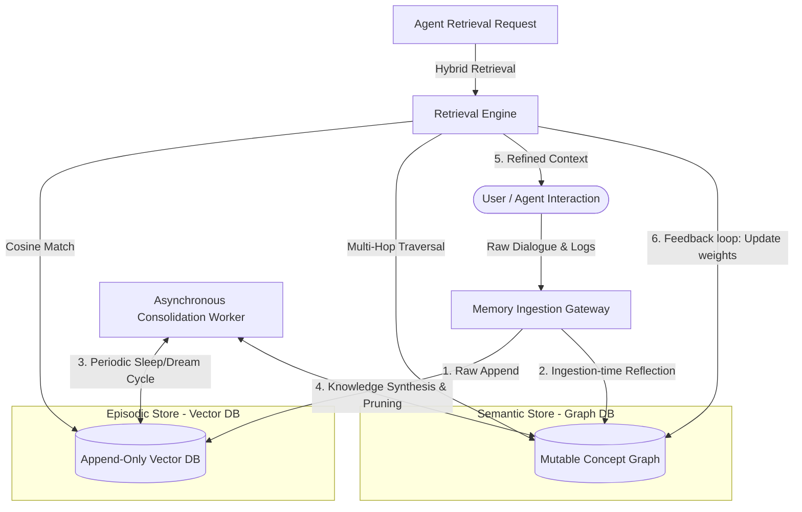
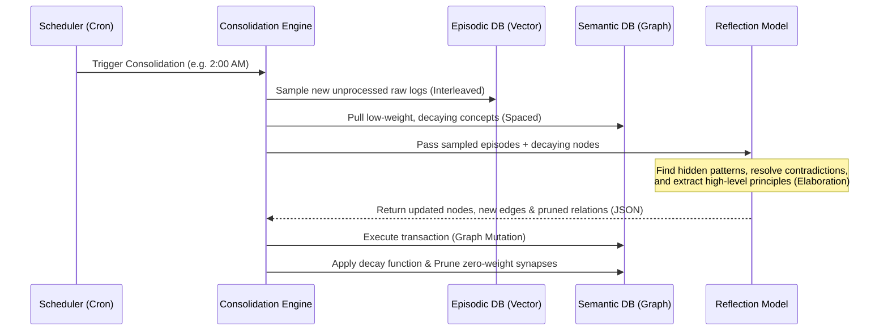

# StickMem: Designing a Cognitive Agent Memory Service Inspired by "Make It Stick"

In the rush to build autonomous AI agents, we have treated memory as a solved database problem. We embed conversations, dump them into a vector database, and call it RAG (Retrieval-Augmented Generation). 

But standard RAG is not memory; it is just a static hard drive. It suffers from **perfect byte-level recall but zero semantic synthesis**. As a result, agents are easily overwhelmed by context window bloat, struggle to form high-level mental models, and cannot adapt their behavior over time. They suffer from what cognitive scientists call the **metacognitive illusion of competence**—they have access to all the text, but they don't *know* anything.

If we want to build agents that genuinely learn, adapt, and build durable intuition, we must look to the science of human learning. 

This post presents the architecture of **StickMem**, a standalone cognitive memory service for LLM agents designed around the principles of the seminal cognitive science book, *Make It Stick: The Science of Successful Learning* (Brown, Roediger, & McDaniel). 

---

## 1. The Core Philosophy: "Desirable Difficulty" in Silicon

The central thesis of *Make It Stick* is that **learning is deeper and more durable when it requires effort**. When learning is easy, it is quickly forgotten. Cognitive psychologists call this **Desirable Difficulty**. 

In AI engineering, we have historically optimized for the exact opposite: zero friction. We feed raw conversational histories directly into agents. This results in three critical failure modes:
1. **Vector Collapse / Semantic Noise**: As the conversation history grows, vector search retrieves superficial keyword-matched fragments, polluting the context window with redundant or conflicting information.
2. **Lack of Abstraction**: The agent cannot bridge different interactions (e.g., debugging a Python script on Monday and a database error on Friday) to form a unified mental model of the user's infrastructure.
3. **Catastrophic Forgetting and Drift**: In long-running tasks, agents lose track of core principles and user preferences as newer conversational tokens crowd out older, foundational concepts.

**StickMem** addresses these failures by introducing "cognitive friction" into the agent's memory cycle. Instead of passive storage, StickMem subjects memory to continuous active encoding, spaced consolidation, and weighted retrieval.

---

## 2. Cognitive Principles Mapped to System Architecture

We can translate the core learning mechanisms from *Make It Stick* directly into software engineering patterns:

| Cognitive Principle (from *Make It Stick*) | Biological Learning Description | Silicon / Agent Architecture Mapping in **StickMem** |
| :--- | :--- | :--- |
| **Retrieval Practice** | Recalling facts from memory strengthens the neural pathway, preventing forgetting. | **Read-Triggered-Write**: Every memory query recalculates and updates the memory's activation weights and last-retrieved timestamp. |
| **Spaced Practice** | Introducing intervals between study sessions allows light decay, making retrieval harder but more durable. | **Asynchronous Memory Consolidation**: A background worker (Sleep/Dream cycle) that periodically aggregates episodic records into concept networks. |
| **Interleaved Practice** | Mixing different subjects trains the brain to recognize underlying patterns and select the correct strategy. | **Cross-Domain Graph Synthesis**: The consolidation engine samples unrelated interaction traces to extract high-level mental models. |
| **Elaboration & Generation** | Explaining new concepts in your own words; attempting to solve problems before being shown the answer. | **Ingestion Middleware (Reflection)**: Intercepting incoming logs to run self-reflection steps, extracting entities, and writing structured relations. |
| **Structure Building** | The ability to discard noise, extract core rules, and organize them into reusable mental models. | **Ontology Extraction & Pruning**: Distilling raw dialogue into a Graph Database schema, discarding conversational fluff. |
| **Metacognitive Calibration** | Using objective feedback (like testing) to align what you *think* you know with what you *actually* know. | **External Evaluator Loop**: Validating agent memories against code sandboxes, external APIs, or human-in-the-loop approvals. |

---

## 3. The Dual-Storage Architecture: Episodic vs. Semantic Memory

Human memory is divided into different subsystems. The hippocampus handles short-term episodic logs, while the neocortex consolidates these into long-term semantic structures. StickMem replicates this via a **Dual-Storage Engine**:



### A. The Episodic Store (The Vector Engine)
* **Purpose**: Retains the high-fidelity, chronological history of interactions. It is **Append-Only** and immutable.
* **Why**: It acts as the "source of truth." If the semantic graph is corrupted or generates false associations (hallucinated relationships), the system can roll back and reconstruct the graph from the episodic logs.

### B. The Semantic Store (The Graph Engine)
* **Purpose**: Stores distilled, structured, and interconnected concepts.
* **Why**: By storing concepts as nodes and relationships as weighted edges, the agent can perform multi-hop reasoning. The weights decay over time unless reinforced through active retrieval.

---

## 4. The Ingestion Engine: Elaboration & Structure Building

When an agent completes a task or session, StickMem intercepts the write. Instead of directly saving the chat log, it runs an **Ingestion Middleware** that performs elaboration.

### Ingestion Middleware Pipeline
1. **Denoising**: Strip out greeting phrases, redundant corrections, and formatting noise.
2. **Entity & Relation Extraction**: Extract entities (e.g., databases, libraries, configurations) and how they relate.
3. **Self-Reflection (Elaboration)**: The agent is prompted with:
   * *“What new rule or constraint was learned in this interaction?”*
   * *“How does this connect to what we already know about this user's system?”*

### Database Schema Design

#### 1. Episodic Storage (SQL + Vector)
```sql
CREATE TABLE episodic_logs (
    id UUID PRIMARY KEY,
    session_id VARCHAR(255) NOT NULL,
    timestamp TIMESTAMP WITH TIME ZONE DEFAULT CURRENT_TIMESTAMP,
    interaction_type VARCHAR(50) NOT NULL, -- e.g., 'dialogue', 'code_execution_failure'
    raw_content TEXT NOT NULL,
    embedding VECTOR(1536) NOT NULL -- Dense vector representing semantic meaning
);
```

#### 2. Semantic Storage (Graph DB - Neo4j Style Schema)
* **Nodes (`Concept` / `Entity`)**:
  * `id`: String (Unique URI/Name, e.g., `pkg:pandas:v1.2`)
  * `type`: String (e.g., `SoftwareLibrary`, `UserPreference`, `ArchitecturalDecision`)
  * `summary`: String (A short description of the entity)
  * `activation_weight`: Float (Current strength: `0.0` to `1.0`)
  * `last_retrieved_at`: Timestamp
* **Edges (`Relation`)**:
  * `source_id` -> `target_id`
  * `relation_type`: String (e.g., `DEPENDS_ON`, `CAUSES_ERROR`, `PREFERS`, `CONTRADICTS`)
  * `confidence_score`: Float (The system's certainty: `0.0` to `1.0`)
  * `evidence_ids`: Array[UUID] (Pointers back to the `episodic_logs.id` that prove this relation exists)

---

## 5. The Retrieval Engine: Retrieval Practice & Activation Spreading

When an agent encounters a new question, StickMem does not just run a flat cosine similarity query. It implements **Retrieval Practice** via a **Spreading Activation Model**. 

### The Retrieval Feedback Loop (Read Triggers Write)
In human brains, retrieving a memory path updates the physical synapse. In StickMem, whenever a concept node is queried and successfully utilized, its activation weight increases.

$$\text{Weight}_{\text{new}} = \min(1.0, \text{Weight}_{\text{old}} + \alpha \cdot \text{UtilityScore})$$

Where $\alpha$ is a learning rate, and $\text{UtilityScore}$ is determined by whether the agent actually used the node in its final response. If a node is retrieved but marked as irrelevant by the agent's editor/evaluator, its weight is penalized.

### Algorithm: Spreading Activation Multi-Hop Retrieval
This algorithm simulates how one memory triggers another (e.g., "Pandas OOM" triggers "Pandas 1.2 Memory Leak" which triggers "Server A Python Upgrade").

```python
def retrieve_cognitive_context(query_text, episodic_db, semantic_graph, threshold=0.15, decay_rate=0.5):
    # Step 1: Semantic match in Episodic Store to find seed nodes
    query_vector = embed_text(query_text)
    seed_episodes = episodic_db.vector_search(query_vector, top_k=5)
    
    # Extract entities linked to these episodes
    active_nodes = {} # node_id -> activation_energy
    
    # Initialize activation energy from seed matches
    for episode in seed_episodes:
        linked_entities = semantic_graph.get_entities_by_evidence(episode.id)
        for entity in linked_entities:
            # Activation energy is initial match score * current node weight
            initial_energy = episode.similarity_score * entity.activation_weight
            active_nodes[entity.id] = max(active_nodes.get(entity.id, 0), initial_energy)
            
    # Step 2: Spreading Activation (2-Hop Traversal)
    retrieved_subgraph = {}
    queue = sorted(active_nodes.items(), key=lambda x: x[1], reverse=True)
    
    visited = set()
    while queue:
        current_node_id, energy = queue.pop(0)
        if current_node_id in visited or energy < threshold:
            continue
        visited.add(current_node_id)
        
        # Save node to retrieved context
        node_data = semantic_graph.get_node(current_node_id)
        retrieved_subgraph[current_node_id] = {
            "node": node_data,
            "energy": energy
        }
        
        # Spread energy to neighbors
        neighbors = semantic_graph.get_neighbors(current_node_id)
        for neighbor, edge in neighbors:
            # Energy degrades based on edge confidence and decay_rate
            spread_energy = energy * edge.confidence_score * decay_rate
            if spread_energy > active_nodes.get(neighbor.id, 0):
                active_nodes[neighbor.id] = spread_energy
                # Add back to queue for next hop evaluation
                queue.append((neighbor.id, spread_energy))
                
        # Re-sort queue by energy
        queue.sort(key=lambda x: x[1], reverse=True)
        
    return format_subgraph_for_prompt(retrieved_subgraph)
```

---

## 6. The Consolidation Engine: Spaced & Interleaved Practice

The brain does not solidify memories in real-time. Consolidation is a slow, offline batch process. StickMem implements this via a background daemon—the **Consolidation Engine** (colloquially, the **Sleep/Dream Service**).

### The Consolidation Pipeline (Run Asynchronously)



### Script: The Consolidation Worker
This Python pseudocode details how the background consolidator synthesizes memories and prunes unused ones.

```python
import math
import datetime

def run_consolidation_cycle(episodic_db, semantic_graph, reflection_llm, decay_constant=0.05):
    # 1. Decay all semantic nodes based on time elapsed since last retrieval
    now = datetime.datetime.utcnow()
    all_nodes = semantic_graph.get_all_nodes()
    
    for node in all_nodes:
        delta_t_days = (now - node.last_retrieved_at).total_seconds() / 86400.0
        # Ebbinghaus-style exponential decay
        node.activation_weight = node.activation_weight * math.exp(-decay_constant * delta_t_days)
        semantic_graph.update_node_weight(node.id, node.activation_weight)
    
    # 2. Interleaved Sampling: Pick new episodes and decaying concepts
    new_episodes = episodic_db.get_unconsolidated(limit=10)
    decaying_nodes = semantic_graph.get_nodes_in_weight_range(low=0.1, high=0.4, limit=5)
    
    if not new_episodes:
        return # Nothing new to consolidate
        
    # 3. Knowledge Synthesis (The Dream Step)
    prompt = f"""
    You are a cognitive consolidator for an LLM Agent.
    Review the following raw recent episodes (interaction history) and existing decaying concepts.
    
    RAW EPISODES:
    {format_episodes(new_episodes)}
    
    DECAYING CONCEPTS:
    {format_concepts(decaying_nodes)}
    
    Perform the following tasks:
    1. Identify links between the new episodes and existing concepts.
    2. Extract high-level, generalized rules/principles learned (Elaboration).
    3. Detect if new information contradicts old nodes (Resolve Conflict).
    4. Output a JSON payload of:
       - nodes_to_create
       - nodes_to_update (summary, boost weight to 1.0 if highly relevant)
       - edges_to_create (with relationship types like 'DEPENDS_ON', 'CONTRADICTS')
    """
    
    structural_changes = reflection_llm.generate_json(prompt)
    
    # 4. Apply Graph Modifications
    semantic_graph.apply_changes(structural_changes)
    
    # 5. Synaptic Pruning (Garbage Collection)
    # Remove edges and nodes that have decayed below the survival threshold
    SURVIVAL_THRESHOLD = 0.05
    semantic_graph.prune_low_weight_elements(SURVIVAL_THRESHOLD)
    
    # Mark episodes as consolidated
    episodic_db.mark_as_consolidated([ep.id for ep in new_episodes])
```

---

## 7. The Dual-System Co-Design: Fast vs. Slow Thinking

To keep API latency under control and optimize compute costs, StickMem structure mirrors Daniel Kahneman’s dual-process theory (popularized as System 1 and System 2):

### System 1 (Fast, Intuitive Runtime)
* **Latency**: <500ms
* **Compute**: Small local LLM (e.g., Llama-3-8B) + Redis Cache
* **Behavior**: When a user inputs a query, System 1 performs a fast vector lookup on high-weight semantic summaries. If the confidence of the match is high, it generates the response immediately. It acts on "instinct" and "pre-compiled instructions."

### System 2 (Slow, Reflective Pipeline)
* **Latency**: 5s - 2min (often run in the background)
* **Compute**: Frontier models (e.g., GPT-4o, Claude Opus, or reasoning models like o1)
* **Behavior**: System 2 is triggered when System 1 fails (user gives negative feedback, test cases fail, or confidence scores drop below a threshold). System 2 executes the slow, multi-hop path traversal, resolves logical conflicts, refines the mental model, and **re-compiles** these rules back into System 1's system prompt or high-weight cache nodes.

By using System 2 to train System 1, the agent behaves like the professional athlete: slow, deliberate practice in the offseason (System 2 consolidation) allows lightning-fast, correct reactions during the game (System 1 execution).

---

## 8. Critical Engineering Challenges & Mitigations

### Challenge 1: The "Super-Node" Problem
* **The Issue**: Nodes representing highly general concepts (e.g., `Language: Python` or `Action: WriteCode`) naturally accumulate thousands of incoming and outgoing edges. During spreading activation, the algorithm hits these nodes and causes an "activation explosion," pulling the entire database into the context window.
* **Mitigation**: 
  1. **Degree Capping**: Hard-stop traversal on nodes with an in/out degree greater than a set threshold (e.g., $N > 50$).
  2. **Inverse Degree Penalization**: Scale down the spread energy when crossing high-degree nodes.
     $$\text{SpreadEnergy} = \text{Energy}_{\text{incoming}} \times \frac{1}{\log(\text{Degree} + 1)}$$

### Challenge 2: Metacognitive Drift (Memory Corruption)
* **The Issue**: Through repeated self-reflection, System 2 might generate false causal relationships, leading to cognitive biases or "agent hallucinated assumptions."
* **Mitigation**: **Immutable Lineage Pointer**. Every relationship edge in the Graph DB *must* contain an array of `evidence_ids` pointing back to raw, immutable logs in the Episodic Store. If a contradiction is detected, or if a user corrects the agent, the system can dynamically fetch the raw episodes and run a re-verification step to validate the edge's existence.

### Challenge 3: Financial Token Cost
* **The Issue**: Running LLM-based consolidation on every dialogue turn is financially unviable.
* **Mitigation**: **Decoupled Consolidation Scheduling**. Episodic writes are cheap. The expensive consolidation engine is only run when:
  1. The agent is idle (system scheduling).
  2. The episodic store accumulates more than $N$ (e.g., 50) unconsolidated items.
  3. A critical failure or "high-emotion" user feedback is registered.

---

## Conclusion: Towards Living Systems

Current AI memory architectures operate like filing cabinets. They store everything exactly as it was received, relying on the retrieval engine to sift through the dust. 

By implementing **StickMem**, we move from filing cabinets to **living cognitive networks**. The system actively forgets the noise, consolidates experiences into reusable mental models, and sharpens its pathways through active retrieval practice. 

Ultimately, this moves LLM agents away from superficial text matching and closer to genuine, adaptive learning—turning them into systems that don't just store information, but truly *make it stick*.
